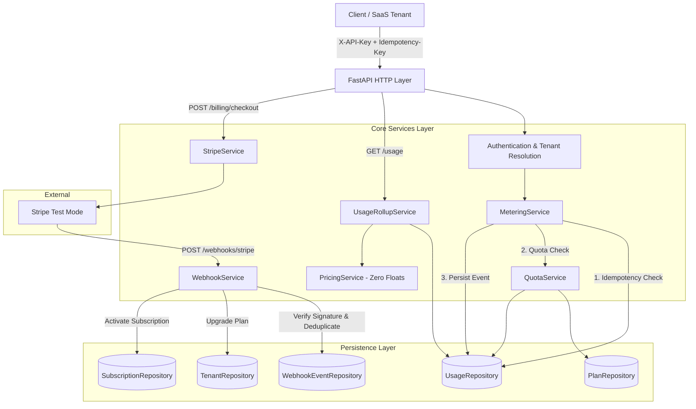

# Usage Metering & Billing Engine

> **FlyRank Backend Track Capstone Project**  
> **Stack:** Python 3.12 + FastAPI + PostgreSQL + SQLAlchemy 2.0 + Alembic + Stripe Test Mode + Pytest + Docker  
> **Repository:** `flyrank-capstone-metering-billing` / `Usage-Metering-Billing-Engine`

A production-grade, multi-tenant backend service designed to answer the three fundamental SaaS questions:
1. **How much has a customer used?**
2. **How much should that usage cost?**
3. **Has the customer reached their plan limits?**

---

## 🏛️ Architecture & Data Flow



---

## ✨ Core Features & Guarantees

- **SaaS Tenant Isolation**: Dynamic tenant resolution via Argon2-hashed API keys (`X-API-Key`). Zero trust in client-supplied tenant IDs.
- **Idempotent Usage Metering**: Guarantees exactly-once metering under network retries via database-level `UNIQUE(tenant_id, idempotency_key)`.
- **Honest Quota Boundaries**: Precise boundary validation (`999 + 1 = 1000` allowed, `1000 + 1 = 1001` rejected with `429 Too Many Requests`).
- **AI Token Pricing Engine**: Strict integer-only micro-cent arithmetic. Reasoning tokens billed as output tokens; cached input tokens discounted.
- **Stripe Test Mode Integration**: Stripe Checkout for subscription upgrades with verified, deduplicated webhooks (`checkout.session.completed`).
- **Background Reconciliation**: Standalone job comparing local database state against Stripe with failure isolation.

---

## 🚀 Getting Started

### 1. Prerequisites
- Python 3.12+
- Docker & Docker Compose (or local PostgreSQL)
- Stripe CLI (for webhook testing)

### 2. Environment Setup
```bash
# Clone repository
git clone https://github.com/Abhi-T-A/Usage-Metering-Billing-Engine.git
cd Usage-Metering-Billing-Engine

# Create and activate virtual environment
python -m venv .venv
# On Windows:
.venv\Scripts\Activate.ps1
# On Linux/macOS:
source .venv/bin/activate

# Install dependencies
pip install -r requirements.txt
```

### 3. Database Initialization
```bash
# Start PostgreSQL via Docker Compose
docker compose up -d

# Copy environment file
cp .env.example .env

# Run Alembic migrations
alembic upgrade head

# Seed plans (FREE, PRO) and demo tenant
python -m app.scripts.seed
python -m app.scripts.seed_tenant
```

### 4. Run the Server
```bash
python -m uvicorn app.main:app --reload --port 8000
```
Interactive Swagger API docs available at: `http://localhost:8000/docs`

---

## 📖 API Reference

### 1. `POST /generate` — Meter Usage
Idempotently records billable usage after verifying subscription quotas.

**Headers:**
- `X-API-Key`: Tenant API Key
- `Idempotency-Key`: Unique UUID / client request key

**Request:**
```json
{
  "type": "API_CALL",
  "quantity": 1
}
```

**Response (New Request: `201 Created`):**
```json
{
  "id": 1,
  "tenant_id": 1,
  "type": "API_CALL",
  "quantity": 1,
  "idempotency_key": "req-001",
  "created_at": "2026-08-29T14:30:00Z",
  "is_duplicate": false
}
```

**Response (Retry: `200 OK`):**
```json
{
  "id": 1,
  "tenant_id": 1,
  "type": "API_CALL",
  "quantity": 1,
  "idempotency_key": "req-001",
  "created_at": "2026-08-29T14:30:00Z",
  "is_duplicate": true
}
```

---

### 2. `GET /usage` — Monthly Usage Rollup
Retrieves month-to-date consumption, remaining quota, and estimated costs.

**Response (`200 OK`):**
```json
{
  "tenant_id": 1,
  "tenant_name": "Demo Tenant",
  "plan_name": "FREE",
  "period_start": "2026-08-01T00:00:00",
  "period_end": "2026-09-01T00:00:00",
  "api_calls": {
    "used": 15,
    "limit": 100,
    "remaining": 85
  },
  "ai_tokens": {
    "used": 4250,
    "limit": 10000,
    "remaining": 5750
  },
  "cost": {
    "total_cost_microcents": 1250000,
    "total_cost_cents": 125
  }
}
```

---

### 3. `POST /billing/checkout` — Stripe Checkout Session
Initiates a Stripe checkout session for plan upgrades.

**Request:**
```json
{
  "plan_name": "PRO"
}
```

**Response (`201 Created`):**
```json
{
  "checkout_url": "https://checkout.stripe.com/c/pay/cs_test_...",
  "session_id": "cs_test_...",
  "plan_name": "PRO"
}
```

---

### 4. `POST /webhooks/stripe` — Signed Webhook Ingestion
Processes verified Stripe events (`checkout.session.completed`) and upgrades tenant plan state idempotently.

---

## 🧪 Testing Acceptance Probes

Run the full deterministic test suite:
```bash
python -m pytest -v
```

### Probes Tested:
- **Probe 1 (Idempotency)**: `tests/test_metering.py`
- **Probe 2 (Quota Boundary)**: `tests/test_quota.py`
- **Probe 3 (Stripe Upgrade)**: `tests/test_stripe_webhook.py`
- **Probe 4 (Webhook Security & Replay)**: `tests/test_stripe_webhook.py`
- **Probe 5 (Pricing Engine)**: `tests/test_pricing.py`
- **Rollup & Isolation**: `tests/test_usage_rollup.py`
- **Reconciliation**: `tests/test_reconciliation.py`

---

## 🔄 Background Subscription Reconciliation
To run the offline reconciliation job manually or in cron:
```bash
python -m app.scripts.reconciliation_job
```

---

## ⚠️ Limitations & Future Stretch Goals

1. **Proration**: Mid-cycle upgrades currently set the new plan immediately; proration credits can be integrated in future iterations.
2. **Real AI Model Calls**: Billable endpoints simulate token quantities without requiring third-party API keys.
3. **Usage Alerts**: 80% and 100% threshold email/webhook alerts can be layered onto the `QuotaService`.

---

## 📄 License

MIT
